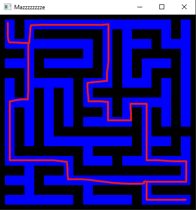
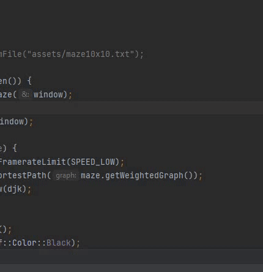
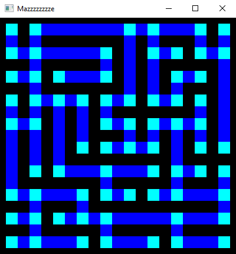
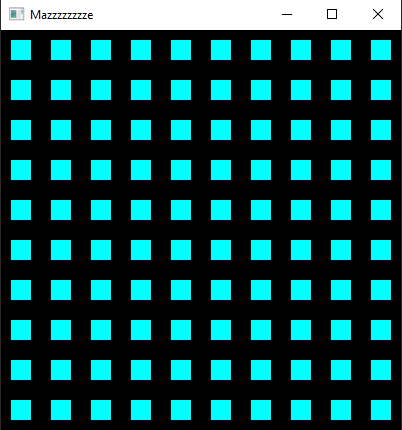
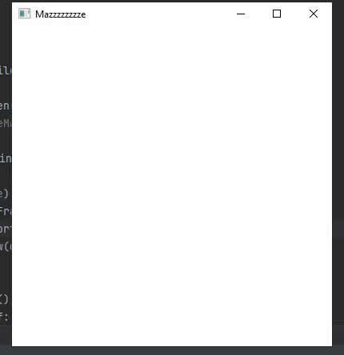

# maze-sfml

A simple visualization of Dijkstra finding the shortest path in maze with the help of C++ and SFML.

## How it works:

First, generated a **maze**. There are two ways:
1. Read given maze from file .txt in assets/mazeMap. 
   ' * '  is the node and ' + ' is the path in maze. 
   If you do this, you have to manually change the corresponding HORIZONTAL and VERTICAL size in Maze.hpp 
   according to the size of the txt maze. 
   Maze from file has more than one possible path to the destination, 
   thus demonstrate better the use of Dijkstra.
   
2. Using Prim to randomly generate maze. 
   Modify the HORIZONTAL and VERTICAL size of the maze in Maze.hpp as you please. 
   Maze generated by Prim only has one solution path (of course).
   
   
   
---

In maze, there is a mazeGraph and a weightedGraph.
1. A **mazeGraph** is the graph generated by maze, 
   with vertex is the node of maze, 
   and edge is the connection between corresponding nodes in maze. 
   All edge weight is equal to 1.
2. A **weightedGraph** is a graph generated right after mazeGraph finishes. 
   It only stores 3 types of maze node: **the dead-end**, **the turn**, and **the junction**. 
   The edge weight is the distance (number of step) between two nodes.
   
---

**Graph** represents vertex by class Node, 
and is maintained by an adjacency list. 
You can connect two nodes, get distance (if available)
between two nodes, and get the neighbor list of a given node in graph.

**Node** is identified by its data (0, 1, ..., N-1), which is the same as vector index. Node is drawn on xy coordinate, started from the top-left with x-axis is horizontal and y-axis is vertical, seperated by space.
    
---

Dijkstra works on the weightedGraph and finds the shortest path from the top-left node to the bottom-right node in graph. 
The cyan square represents vertex of the weighted graph. 
The blue rectangle is edge of graph. 
The green rectangle is the path Dijkstra walked through. 
The red square is the node Dijkstra is currently on. 
Distance of each node is updated on the go.
The red path is the final shortest path Dijkstra found.
    

---

## Library
[SFML (version 2.5.1)](https://www.sfml-dev.org/download/sfml/2.5.1/) as graphic library